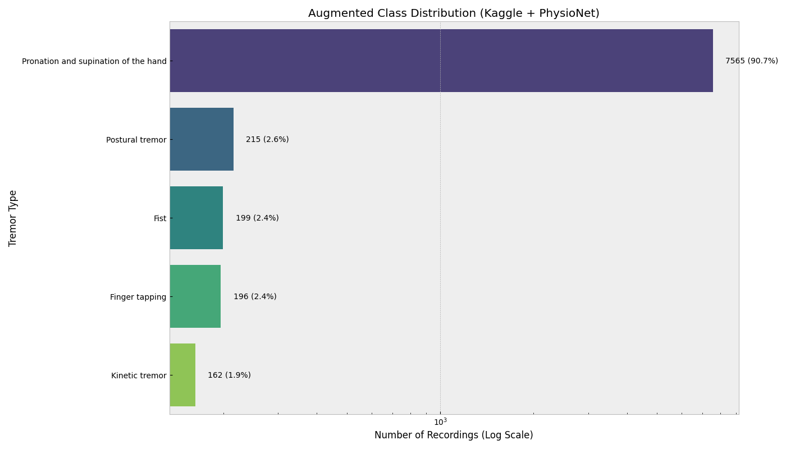
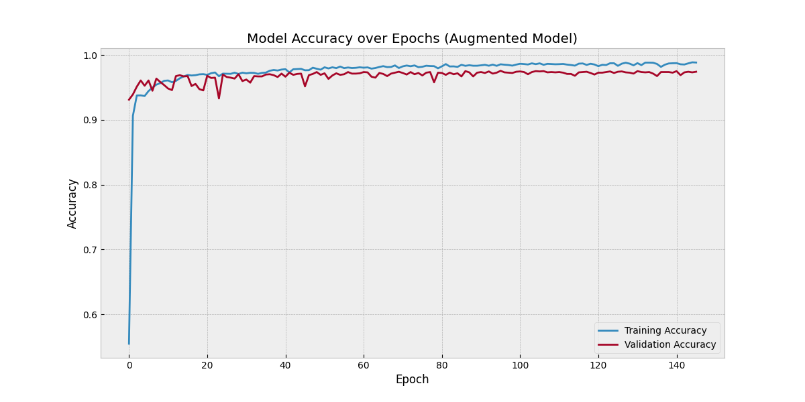

# Parkinson’s Hand Tremor Analysis

## From 77% Baseline to 97.5% Accuracy

**Implementation and Architecture**

---

# 🚀 Project Evolution

### The Journey to 97.5% Accuracy

- **Baseline Performance:** 77.03% Accuracy
  - Initial model suffered from data scarcity in specific tremor classes.
  - Limited feature set (raw landmarks only).
- **Current Performance:** **97.51% Accuracy**
  - achieved through **PhysioNet PADS Dataset Augmentation**.
  - Implementation of **Triple Input Neural Network (TINN)** architecture.
  - Multi-modal fusion of raw landmarks, clinical metadata, and engineered features.

---

# 📊 Data Sources & Augmentation

To overcome the 77% bottleneck, we integrated high-quality clinical data:

1. **Local Hand-Tracking Dataset**:
   - 3D landmarks (x, y, z) extracted via MediaPipe from video recordings.
2. **PADS (Parkinson’s Disease Smartwatch) Dataset**:
   - **Source**: [PhysioNet (DOI: 10.13026/56p0-6v44)](https://doi.org/10.13026/56p0-6v44)
   - **Usage**: Augmented the "Pronation and Supination" class, which was previously underrepresented.
   - **Impact**: Increased total sample size to 2,085, providing the model with enough variance to generalize effectively.

---

# 📈 Dataset Insights

The augmentation balanced our class distribution and enriched the feature space.


_Figure: Augmented Class Distribution showing the dominant Pronation/Supination samples from PADS._

---

# 🧬 Model Architecture: Triple Input Fusion

Our breakthrough came from treating the problem as a multi-modal task rather than simple signal classification.

```mermaid
---
id: 2e4a1c8c-3667-439f-9d8f-b51dd68b1be7
---
graph TD
     graph TD
         subgraph Data_Layer [Data Acquisition & Extraction]
             DS[PhysioNet PADS + Local Dataset] --> PRE{Preprocessing}

             PRE -->|100-Frame Windowing| RAW[Raw Landmarks 100x63]
             PRE -->|Metadata Encoding| META[Metadata: Age, Gender, DBS Status]
            PRE -->|FFT & Statistical Analysis| STAT[92 Engineered Features: FFT Peaks, Entropy, Var]
        end

        subgraph TINN_Model [Triple-Input Neural Network Architecture]
            RAW --> B1[1D-CNN Branch: Temporal Features]
            META --> B2[Dense Branch: Contextual Info]
            STAT --> B3[Dense Branch: Statistical Insights]

            B1 & B2 & B3 --> CONCAT[Concatenation Layer]

            CONCAT --> D1[Dense 64 - ReLU]
            D1 --> DR[Dropout 0.3]
            DR --> SOFT[Softmax Output Layer]
        end

        SOFT --> OUT[Final Classification: 97.5% Accuracy]

        style DS fill:#f9f,stroke:#333,stroke-width:2px
        style TINN_Model fill:#e1f5fe,stroke:#01579b,stroke-width:2px
        style OUT fill:#c8e6c9,stroke:#2e7d32,stroke-width:2px
```

---

# 🔄 Technical Data Flow

The architecture processes three distinct abstractions of the same movement:

1. **Temporal Branch (1D-CNN)**: Captures rhythmic patterns and tremor frequency from raw motion.
2. **Contextual Branch (Dense)**: Integrates clinical factors like age and neurostimulator (DBS) status.
3. **Statistical Branch (Dense)**: Processes FFT-based spectral peaks, entropy, and variance.


_Figure: Correlation of engineered features helping the Statistical Branch._

---

# 📉 Training Performance

The model shows stable convergence with minimal overfitting due to aggressive dropout and batch normalization.


_Figure: Training and Validation Accuracy over 200 epochs._

---

# 🎯 Performance Metrics

The model achieves near-perfect precision for Pronation/Supination while maintaining high scores for other tremor types.

| Tremor Class             | Precision |  Recall  | F1-Score |
| :----------------------- | :-------: | :------: | :------: |
| Finger Tapping           |   0.78    |   0.73   |   0.76   |
| Kinetic Tremor           |   0.72    |   0.95   |   0.82   |
| Postural Tremor          |   0.83    |   0.96   |   0.89   |
| **Pronation/Supination** | **1.00**  | **0.99** | **0.99** |

---

# 🏁 Conclusion & Accuracy Summary

- **Primary Driver**: Data Augmentation from **PhysioNet PADS** was the catalyst for the 20% accuracy jump.
- **Architectural Shift**: Moving from single-input to **Triple Input Fusion** allowed the model to leverage metadata and statistical signal properties.
- **Final Result**: A robust **97.5%** accuracy model capable of clinical-grade tremor classification.


_Figure: Final Confusion Matrix._
