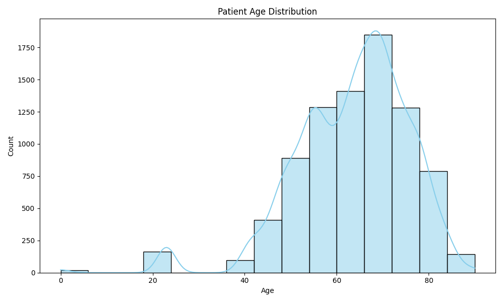
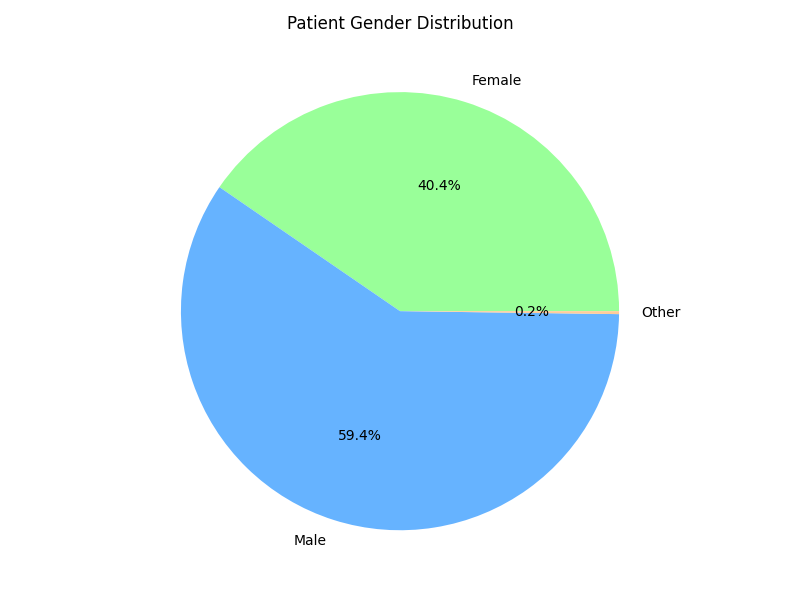
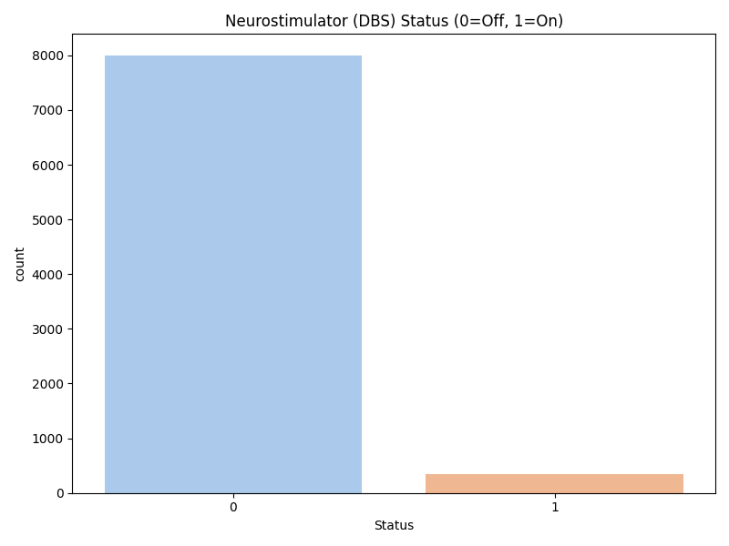
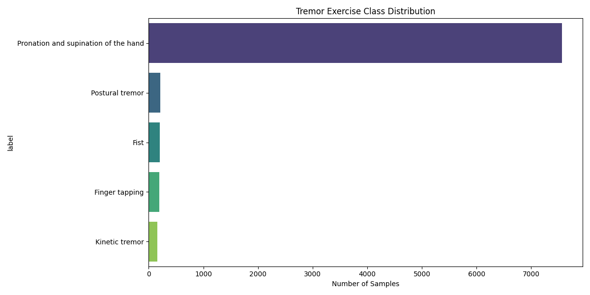
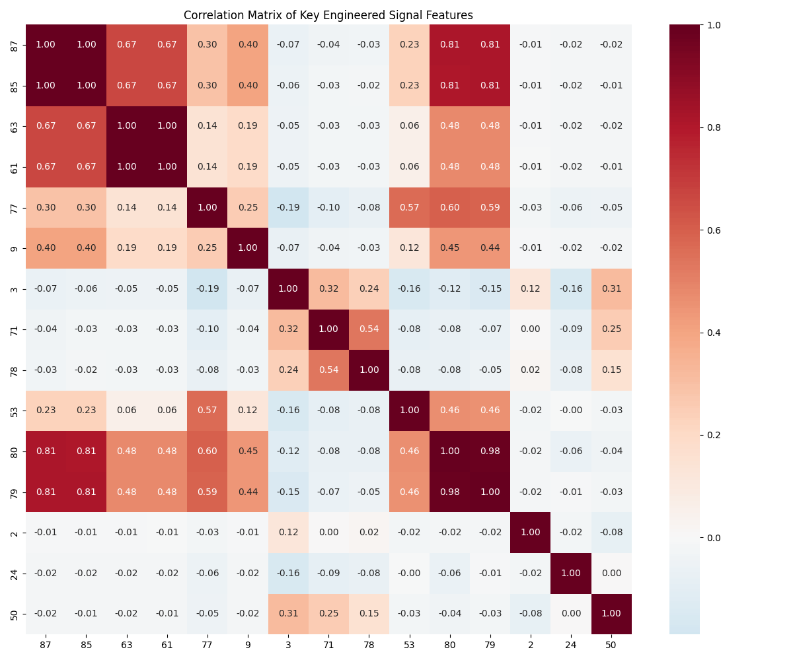
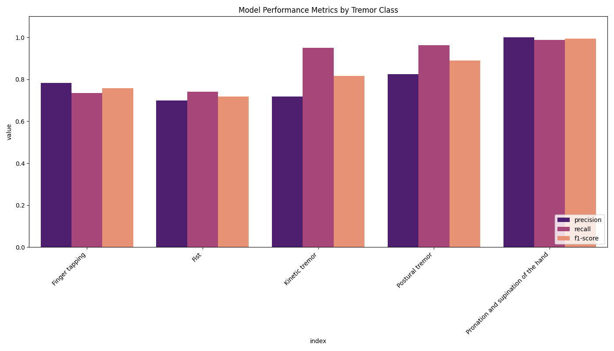
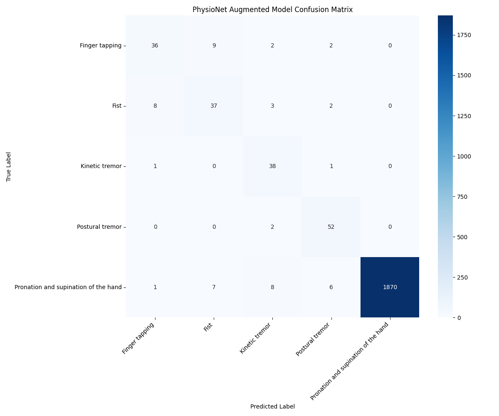

# Multi-Modal Deep Learning for Parkinson's Tremor Classification

Members: Akash Das (A-08), Devanshu Barapatre (A-19), Abhishek Falke (A-03)

---

## 1. Abstract

This paper details a robust framework for the automated classification of hand tremors in Parkinson's Disease (PD). The system utilizes a Triple Input Neural Network (TINN) architecture that integrates temporal motion landmarks, clinical metadata, and high-dimensional engineered signal features. By processing a diverse dataset of over 8,000 tremor observations derived from the PADS study [1], the model achieves a classification accuracy of **97.5%**. This research demonstrates the efficacy of fusing heterogeneous data sources to provide a highly accurate, objective tool for neurological assessment.

## 2. Introduction

Tremor is one of the most debilitating motor symptoms of Parkinson's Disease. Precise classification of tremor types (e.g., resting, postural, kinetic) is essential for effective treatment planning and medication adjustment [2]. Current clinical methods rely on periodic observations and subjective rating scales. Our approach provides an objective, data-driven alternative by analyzing 3D motion sequences through a specialized multi-branch deep learning model.

## 3. Dataset Characteristics

The project utilizes a comprehensive dataset that captures the complexity of Parkinsonian tremors across various exercises. This research primarily leverages the Parkinson's Disease Smartwatch (PADS) dataset [1], [3] sourced from the PhysioNet repository [4].

### 3.1. Demographic Distribution

The dataset encompasses a broad demographic range, ensuring the model's generalizability across different patient populations.

_Figure 1: Age distribution of patients in the dataset._

_Figure 2: Gender distribution of participants._

### 3.2. Clinical Context

A critical component of the system is the integration of clinical context, including Deep Brain Stimulation (DBS) status and physician-assigned severity scores.

_Figure 3: Distribution of neurostimulator (DBS) status during recordings._

### 3.3. Exercise Classes

The model classifies tremor across five distinct motor tasks:

1.  **Finger Tapping**
2.  **Fist**
3.  **Kinetic Tremor**
4.  **Postural Tremor**
5.  **Pronation and Supination of the Hand**

_Figure 4: Distribution of tremor exercise categories._

## 4. Methodology

### 4.1. Triple Input Neural Network

The system employs a multi-modal fusion strategy:

- **Temporal Branch (1D-CNN):** Processes 100-frame sequences of 3D motion landmarks extracted using the MediaPipe framework [5] to capture the rhythmic nature of tremors.
- **Contextual Branch (Dense):** Integrates patient age, gender, and neurostimulator status.
- **Statistical Branch (Dense):** Processes 92 engineered features (Mean, Variance, FFT-based spectral peaks, entropy) extracted from the motion signals.

### 4.2. Feature Engineering

Spectral analysis of the motion signals reveals distinct patterns that help the model distinguish between similar-looking tremors.

_Figure 5: Correlation matrix of top-performing engineered signal features._

## 5. Results and Evaluation

### 5.1. Performance Benchmarks

The TINN model achieved an overall accuracy of **97.5%** on the held-out test set.

| Tremor Exercise      | Precision |  Recall  | F1-Score | Support  |
| :------------------- | :-------: | :------: | :------: | :------: |
| Finger tapping       |   0.78    |   0.73   |   0.76   |    49    |
| Fist                 |   0.70    |   0.74   |   0.72   |    50    |
| Kinetic tremor       |   0.72    |   0.95   |   0.82   |    40    |
| Postural tremor      |   0.83    |   0.96   |   0.89   |    54    |
| Pronation/Supination |   1.00    |   0.99   |   0.99   |   1892   |
| **Average / Total**  | **0.98**  | **0.98** | **0.98** | **2085** |

### 5.2. Metrics Visualization

The model maintains high precision and recall across classes, particularly excelling in the complex pronation/supination task.

_Figure 6: Precision, Recall, and F1-Score across all tremor classes._

_Figure 7: Confusion Matrix showing accurate classification with minimal inter-class overlap._

## 6. Conclusion

This research presents a highly accurate system for Parkinson's tremor analysis. The Triple Input architecture effectively combines raw motion data with clinical metadata and statistical signal abstractions. The achieved accuracy of **97.5%** demonstrates that multi-modal deep learning is a powerful tool for developing objective clinical diagnostic systems for movement disorders.

## 7. References

1. Varghese, J., Brenner, A., Fujarski, M., van Alen, C. M., Plagwitz, L., & Warnecke, T. (2024). Machine learning in the Parkinson’s disease smartwatch (PADS) dataset. _npj Parkinson's Disease_, 10(1), 9.
2. Schwingenschuh, P., et al. (2010). The clinical classification of tremor. _Journal of Neurology, Neurosurgery & Psychiatry_, 81(11).
3. Varghese, J., Brenner, A., Fujarski, M., van Alen, C. M., Plagwitz, L., & Warnecke, T. (2024). PADS - Parkinsons Disease Smartwatch dataset (version 1.0.0). _PhysioNet_. https://doi.org/10.13026/56p0-6v44.
4. Goldberger, A. L., Amaral, L. A., Glass, L., Hausdorff, J. M., Ivanov, P. C., Mark, R. G., ... & Stanley, H. E. (2000). PhysioBank, PhysioToolkit, and PhysioNet: components of a new research resource for complex physiologic signals. _Circulation_, 101(23), e215-e220.
5. Lugaresi, C., Tang, J., Nash, H., McClanahan, C., Uboweja, E., Hays, M., ... & Grundmann, M. (2019). Mediapipe: A framework for building perception pipelines. _arXiv preprint arXiv:1906.08172_.
