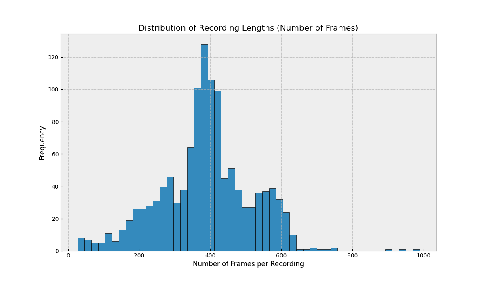
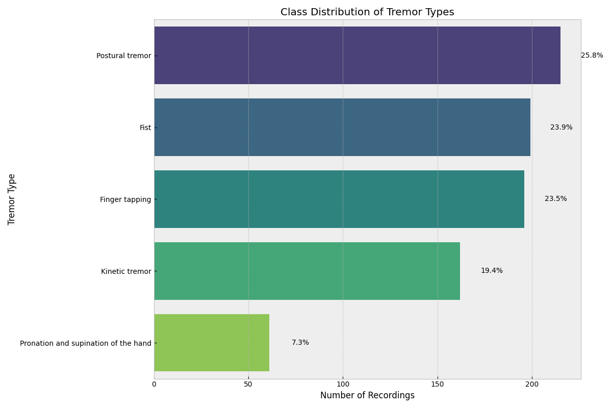
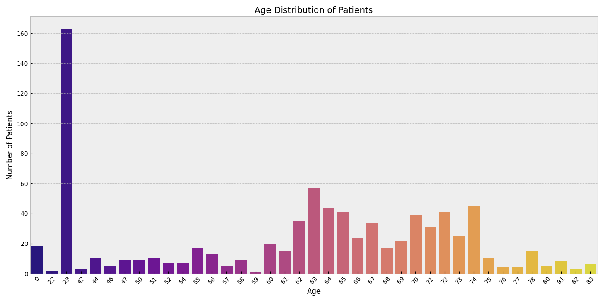
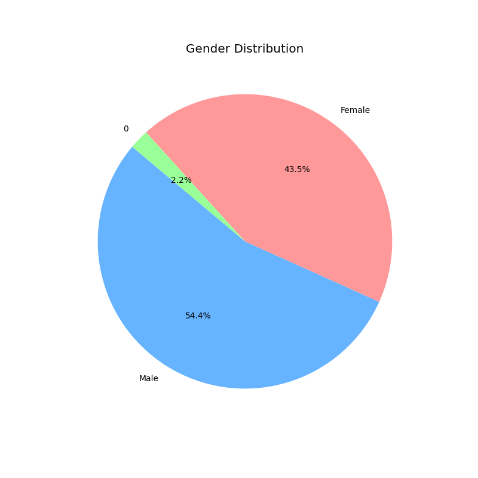
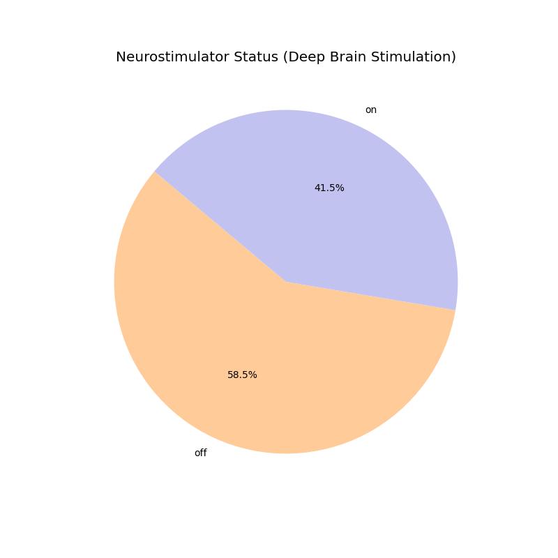
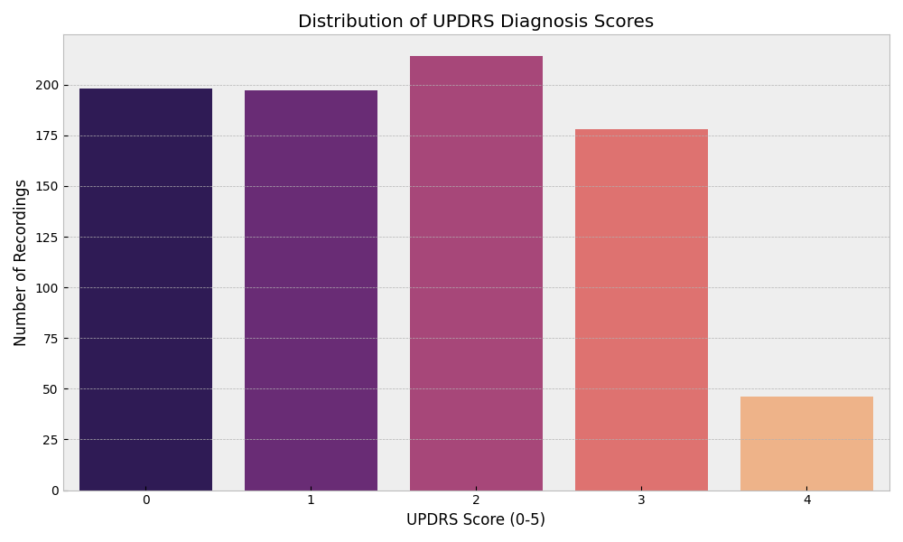

# Visualization Explanations

Here are the explanations for each generated visualization, providing insights into the dataset used for Parkinson's tremor analysis:

### 1. Distribution of Recording Lengths

This histogram shows the distribution of the lengths of the recordings in the dataset.
*   **X-axis (Number of Frames per Recording):** Represents the duration of each tremor recording in terms of the total number of frames captured.
*   **Y-axis (Frequency):** Shows how many recordings fall into each length bucket.
*   **Insight:** This helps us understand the variance in recording duration. We can see that most recordings are short, typically under 200 frames, with a few extending longer. This is important for preparing the data for the model, which expects a fixed-length input (100 frames).

### 2. Class Distribution of Tremor Types

This bar chart displays the number of recordings available for each category of Parkinson's tremor.
*   **Y-axis (Tremor Type):** Lists the different types of tremor exercises recorded (e.g., Postural tremor, Fist, Finger tapping).
*   **X-axis (Number of Recordings):** Shows the total count of recordings for each type. The percentages indicate each category's share of the total dataset.
*   **Insight:** This visualization reveals a class imbalance in the dataset. "Postural tremor," "Fist," and "Finger tapping" have significantly more data than "Pronation and supination of the hand." This imbalance can affect the model's performance, potentially making it less accurate for underrepresented classes.

### 3. Age Distribution of Patients

This bar chart illustrates the age distribution of the patients in the dataset.
*   **X-axis (Age):** Shows the different ages of the patients.
*   **Y-axis (Number of Patients):** Indicates how many patients belong to each age group.
*   **Insight:** The graph shows a wide range of ages, with a concentration of patients in their 60s and 70s, which is consistent with the typical age of onset for Parkinson's disease.

### 4. Gender Distribution

This pie chart breaks down the gender distribution of the patients in the dataset.
*   **Slices:** Each slice represents a gender category (Male, Female, and '0' which likely represents undisclosed or other).
*   **Insight:** It shows that the dataset contains more data from male patients (54.4%) than female patients (43.5%). This is another potential source of bias to be aware of during modeling.

### 5. Neurostimulator Status (Deep Brain Stimulation)

This pie chart shows the proportion of recordings taken when the patient's Deep Brain Stimulation (DBS) device was 'on' versus 'off'.
*   **Slices:** Represent the 'on' and 'off' states of the neurostimulator.
*   **Insight:** A majority of the recordings (58.5%) were captured with the neurostimulator turned 'off'. Since DBS is designed to suppress tremors, this feature is a critical input for the model to understand the context of the tremor data.

### 6. Distribution of UPDRS Diagnosis Scores

This bar chart shows the distribution of the Unified Parkinson's Disease Rating Scale (UPDRS) scores assigned by doctors.
*   **X-axis (UPDRS Score):** Represents the clinical score from 0 to 5, indicating the severity of the tremor.
*   **Y-axis (Number of Recordings):** Shows how many recordings fall under each score.
*   **Insight:** This chart provides a sense of the severity of tremors in the dataset. Most recordings are associated with moderate scores (2 and 3), with fewer examples at the lowest (0) and highest (5) ends of the severity scale.
